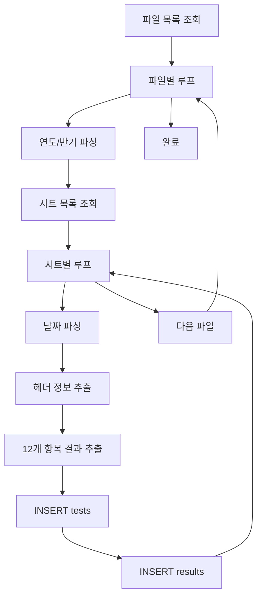

# 정제수 ETL 매핑 정의 (Purified Water ETL Mapping)

본 문서는 정제수성적서 Excel 파일에서 Supabase 테이블로의 데이터 매핑을 정의합니다.

---

## 1. 소스 개요

### 1.1 소스 파일 위치
```
migration_docs/서식 샘플/정제수/
```

### 1.2 파일 목록 (27개)
| 연도 | 상반기 | 하반기 | 비고 |
|------|--------|--------|------|
| 2012 | - | 정제수성적서(2012년8월).xls | 구버전 포맷 |
| 2013 | - | 정제수성적서(2013년 후반기).xlsx | 구버전 포맷 |
| 2014 | 정제수성적서_2014년 상반기.xls | 정제수성적서_2014년 하반기.xlsx | 상반기 .xls |
| 2015 | 정제수성적서_2015년 상반기.xlsx | 정제수성적서_2015년 하반기.xlsx | |
| 2016 | 정제수성적서_2016년 상반기.xlsx | 정제수성적서_2016년 하반기.xlsx | |
| 2017 | 정제수성적서_2017년 상반기.xlsx | 정제수성적서_2017년 하반기.xlsx | |
| 2018 | 정제수성적서_2018년 상반기.xlsx | 정제수성적서_2018년 하반기.xlsx | |
| 2019 | 정제수성적서_2019년 상반기.xlsx | 정제수성적서_2019년 하반기.xlsx | |
| 2020 | 정제수성적서_2020년 상반기.xlsx | 정제수성적서_2020년 하반기.xlsx | |
| 2021 | 정제수성적서_2021년 상반기.xlsx | 정제수성적서_2021년 하반기.xlsx | |
| 2022 | 정제수성적서_2022년 상반기.xlsx | 정제수성적서_2022년 하반기.xlsx | |
| 2023 | 정제수성적서_2023년 상반기.xlsx | 정제수성적서_2023년 하반기.xlsx | |
| 2024 | 정제수성적서_2024년 상반기.xlsx | - | |
| 2025 | 정제수성적서_2025년 상반기.xlsx | 정제수성적서_2025년 하반기.xlsx | |

**추가 파일 (ETL 대상에서 제외)**:
- `정제수pH통계.xls` - 통계 파일, 마이그레이션 제외
- `정제수성적서.xls` - 템플릿 파일, 마이그레이션 제외

### 1.3 파일명 패턴
```python
# 신규 표준 패턴 (2014~2025)
r"정제수성적서_(\d{4})년 (상반기|하반기)\.(xlsx|xls)"

# 구버전 패턴 (2012~2013)
r"정제수성적서\((\d{4})년\s*(후반기|8월)\)\.(xlsx|xls)"

# 구버전 특수 패턴
r"정제수성적서\((\d{4})년(\d{1,2})월\)\.xls"  # e.g., 2012년8월
```

### 1.4 연도/반기 파싱 로직
```python
def parse_filename(filename: str) -> tuple[int, str]:
    """파일명에서 연도와 반기를 추출"""
    # 표준 패턴
    match = re.match(r"정제수성적서_(\d{4})년\s*(상반기|하반기)", filename)
    if match:
        return int(match.group(1)), match.group(2)
    
    # 구버전 패턴 (후반기 → 하반기)
    match = re.match(r"정제수성적서\((\d{4})년\s*후반기\)", filename)
    if match:
        return int(match.group(1)), "하반기"
    
    # 월별 패턴 (8월 → 하반기)
    match = re.match(r"정제수성적서\((\d{4})년(\d{1,2})월\)", filename)
    if match:
        year = int(match.group(1))
        month = int(match.group(2))
        half = "상반기" if month <= 6 else "하반기"
        return year, half
    
    raise ValueError(f"Unknown filename pattern: {filename}")
```

---

## 2. 시트 구조

### 2.1 시트명 패턴
각 파일에는 일별 시트가 존재 (반기당 약 180일, 휴무일 제외 시 약 120개 시트)

| 시트명 예시 | 파싱 결과 |
|------------|----------|
| `12월 31일` | month=12, day=31 |
| `7월1일` | month=7, day=1 (공백 없음 주의) |
| `1월 1일` | month=1, day=1 |
| `Sheet1` | **스킵** (데이터 없음) |
| `Sheet2` | **스킵** |
| `총괄표` | **스킵** (요약 시트) |

### 2.2 시트명 파싱 로직
```python
def parse_sheet_name(sheet_name: str, year: int, half: str) -> date | None:
    """시트명에서 날짜 추출"""
    # 스킵할 시트
    skip_patterns = ["Sheet", "총괄", "목차", "요약"]
    if any(p in sheet_name for p in skip_patterns):
        return None
    
    # 날짜 파싱: "12월 31일", "7월1일" 등
    match = re.match(r"(\d{1,2})월\s*(\d{1,2})일", sheet_name)
    if not match:
        return None
    
    month = int(match.group(1))
    day = int(match.group(2))
    
    # 연도 결정 (반기 기준)
    # 상반기: 1~6월, 하반기: 7~12월
    # 예외: 하반기 파일에 1월 시트가 있으면 다음 연도
    if half == "상반기" and month > 6:
        return None  # 잘못된 데이터
    if half == "하반기":
        if month <= 6:
            year += 1  # 하반기 파일의 1~6월은 다음 연도
    
    try:
        return date(year, month, day)
    except ValueError:
        return None  # 유효하지 않은 날짜
```

---

## 3. 타겟 테이블

### 3.1 labdoc_demo_purified_water_tests (테스트 헤더)
| 컬럼명 | 타입 | 설명 | 필수 |
|--------|------|------|------|
| id | uuid | PK (자동생성) | O |
| test_date | date | 검사 일자 | O |
| material_name | varchar(50) | 검체명 | - |
| sample_amount | varchar(20) | 검체량 | - |
| sampling_location | varchar(50) | 채취 장소 | - |
| collector | varchar(50) | 시료 채취자 | - |
| inspector | varchar(50) | 검사 수행자 | - |
| overall_result | varchar(20) | 종합 판정 | - |
| source_file | text | 원본 파일명 | - |
| source_sheet | text | 원본 시트명 | - |
| source_row | int | 원본 행 번호 | - |

**UNIQUE 제약**: `(test_date, source_file)`

### 3.2 labdoc_demo_purified_water_test_results (테스트 결과)
| 컬럼명 | 타입 | 설명 | 필수 |
|--------|------|------|------|
| id | uuid | PK (자동생성) | O |
| test_id | uuid | FK → tests | O |
| test_item_code | varchar(30) | 시험항목 코드 | O |
| test_item_name | varchar(50) | 항목명 (한글) | - |
| specification | text | 시험 기준 | - |
| result_value | text | 결과값 (텍스트) | - |
| result_numeric | decimal(10,4) | 숫자형 결과 | - |
| judgment | varchar(20) | 판정 결과 | - |
| test_frequency | varchar(10) | 검사 빈도 | - |

**UNIQUE 제약**: `(test_id, test_item_code)`

---

## 4. Excel 셀 매핑 (테스트 헤더)

### 4.1 셀 좌표 정의
```
Row 5:  시험일자: 2025 년 12월 31일  ← test_date (텍스트 파싱)
Row 7:  검체명(C), 검체량(D), 채취장소(I), 채취자(K)
Row 25: 검사자(I)
```

### 4.2 상세 매핑
| Excel 위치 | 내용 예시 | 타겟 컬럼 | 파싱 규칙 |
|-----------|----------|----------|----------|
| Row 5 (병합셀) | `시험일자: 2025 년 12월 31일` | `test_date` | 정규식 추출 |
| Row 7, Col C | `정제수` | `material_name` | 그대로 |
| Row 7, Col D | `200 g` | `sample_amount` | 그대로 |
| Row 7, Col I | `제조실` | `sampling_location` | 그대로 |
| Row 7, Col K | `이온유` | `collector` | 그대로 |
| Row 25, Col I | `박성철` | `inspector` | 그대로 |
| 계산 | `적합`/`부적합` | `overall_result` | 결과 집계 |

### 4.3 test_date 파싱
```python
def parse_test_date_from_cell(cell_value: str, sheet_date: date) -> date:
    """
    Cell 값에서 날짜 추출
    예: "시험일자: 2025 년 12월 31일" → date(2025, 12, 31)
    
    fallback: 시트명에서 파싱한 날짜 사용
    """
    if not cell_value:
        return sheet_date
    
    # 정규식으로 연월일 추출
    match = re.search(r"(\d{4})\s*년\s*(\d{1,2})\s*월\s*(\d{1,2})\s*일", str(cell_value))
    if match:
        return date(int(match.group(1)), int(match.group(2)), int(match.group(3)))
    
    return sheet_date
```

### 4.4 overall_result 계산
```python
def calculate_overall_result(results: list[dict]) -> str:
    """
    모든 항목 판정 기반 종합 결과 계산
    - 하나라도 FAIL이면 '부적합'
    - 모두 PASS 또는 NA이면 '적합'
    """
    for r in results:
        if r["judgment"] == "FAIL":
            return "부적합"
    return "적합"
```

---

## 5. Excel 셀 매핑 (테스트 결과)

### 5.1 시험항목 행 매핑 (12개)
| Row | 시험항목 (한글) | item_code | specification | result 위치 | judgment 위치 | 빈도 |
|-----|----------------|-----------|---------------|-------------|---------------|------|
| 12 | 성상 | `appearance` | 무색투명액상,무취,무미 | Col H | Col J | daily |
| 13 | pH | `ph` | 5.0~7.0 | Col H | Col J | daily |
| 14 | 염화물 | `chloride` | 액이 변해선 안됨 | Col H | Col J | daily |
| 15 | 황산염 | `sulfate` | 액이 변해선 안됨 | Col H | Col J | daily |
| 16 | 중금속 | `heavy_metals` | 비교액보다 진해선 안됨 | Col H | Col J | daily |
| 17 | 잔류염소 | `residual_chlorine` | 색을 나타내선 안됨 | Col H | Col J | weekly |
| 18 | 암모니아 | `ammonia` | 액이 변해선 안됨 | Col H | Col J | weekly |
| 19 | 이산화탄소 | `carbon_dioxide` | 액이 변해선 안됨 | Col H | Col J | weekly |
| 20 | 칼륨 | `potassium` | 액이 변해선 안됨 | Col H | Col J | weekly |
| 21 | 과망간산칼륨환원성물질 | `permanganate` | 홍색이 없어져선 안됨 | Col H | Col J | weekly |
| 22 | 증발잔류물 | `evaporation_residue` | 1mg 이하 | Col H | Col J | weekly |
| 23 | 미생물 | `microorganism` | 100 CFU/g 이하 | Col H | Col J | weekly |

### 5.2 셀 좌표 상세
```
Col A-B: 항목 번호 (무시)
Col C-G: 시험항목명 + 시험기준 (병합셀)
Col H:   결과 값 (result_value)
Col I:   단위 또는 빈칸
Col J:   판정 (적합/부적합/해당사항 없음)
```

### 5.3 결과 행 추출 로직
```python
TEST_ITEMS = [
    {"row": 12, "code": "appearance", "name": "성상", "spec": "무색투명액상,무취,무미", "freq": "daily"},
    {"row": 13, "code": "ph", "name": "pH", "spec": "5.0~7.0", "freq": "daily"},
    {"row": 14, "code": "chloride", "name": "염화물", "spec": "액이 변해선 안됨", "freq": "daily"},
    {"row": 15, "code": "sulfate", "name": "황산염", "spec": "액이 변해선 안됨", "freq": "daily"},
    {"row": 16, "code": "heavy_metals", "name": "중금속", "spec": "비교액보다 진해선 안됨", "freq": "daily"},
    {"row": 17, "code": "residual_chlorine", "name": "잔류염소", "spec": "색을 나타내선 안됨", "freq": "weekly"},
    {"row": 18, "code": "ammonia", "name": "암모니아", "spec": "액이 변해선 안됨", "freq": "weekly"},
    {"row": 19, "code": "carbon_dioxide", "name": "이산화탄소", "spec": "액이 변해선 안됨", "freq": "weekly"},
    {"row": 20, "code": "potassium", "name": "칼륨", "spec": "액이 변해선 안됨", "freq": "weekly"},
    {"row": 21, "code": "permanganate", "name": "과망간산칼륨환원성물질", "spec": "홍색이 없어져선 안됨", "freq": "weekly"},
    {"row": 22, "code": "evaporation_residue", "name": "증발잔류물", "spec": "1mg 이하", "freq": "weekly"},
    {"row": 23, "code": "microorganism", "name": "미생물", "spec": "100 CFU/g 이하", "freq": "weekly"},
]

RESULT_COL = "H"  # 8
JUDGMENT_COL = "J"  # 10
```

---

## 6. 값 변환 규칙

### 6.1 judgment 값 변환
| 원본 값 (Excel) | 변환 후 (DB) | 비고 |
|----------------|--------------|------|
| `적합` | `PASS` | |
| `부적합` | `FAIL` | |
| `해당사항 없음` | `NA` | |
| `해당사항없음` | `NA` | 공백 없는 버전 |
| `〃` (ditto mark) | `NA` | 이전 값이 NA일 때 사용 |
| `"` (큰따옴표) | `NA` | ditto mark 대체 |
| 빈셀/None | `NA` | weekly 항목에서 |
| `불검출` | `PASS` | 미생물 항목 |

### 6.2 result_value 값 변환
| 원본 값 | 타겟 | 비고 |
|---------|------|------|
| `적합` | `적합` (그대로) | 성상 등 |
| `5.5` ~ `7.0` | `5.5` (그대로) | pH 숫자값 |
| `불검출` | `불검출` | 미생물 |
| `해당사항 없음` | `NULL` | weekly 미검사일 |
| 빈셀 | `NULL` | |

### 6.3 result_numeric 변환 (pH 전용)
```python
def extract_numeric_result(item_code: str, result_value: str) -> float | None:
    """
    pH 항목에서 숫자값 추출
    """
    if item_code != "ph":
        return None
    
    if not result_value:
        return None
    
    try:
        value = float(str(result_value).strip())
        # pH 범위 검증 (0~14)
        if 0 <= value <= 14:
            return value
        return None
    except (ValueError, TypeError):
        return None
```

### 6.4 judgment 변환 로직
```python
def convert_judgment(
    raw_value: str,
    item_code: str,
    result_value: str,
    prev_judgment: str | None = None
) -> str:
    """
    원본 판정값을 표준화된 값으로 변환
    """
    if not raw_value or str(raw_value).strip() == "":
        return "NA"
    
    val = str(raw_value).strip()
    
    # 직접 매핑
    mapping = {
        "적합": "PASS",
        "부적합": "FAIL",
        "해당사항 없음": "NA",
        "해당사항없음": "NA",
        "불검출": "PASS",  # 미생물
    }
    
    if val in mapping:
        return mapping[val]
    
    # Ditto mark 처리
    if val in ["〃", '"', "''", "〃〃"]:
        return prev_judgment if prev_judgment else "NA"
    
    # pH 숫자 판정 (5.0~7.0 범위)
    if item_code == "ph" and result_value:
        try:
            ph = float(result_value)
            return "PASS" if 5.0 <= ph <= 7.0 else "FAIL"
        except:
            pass
    
    # 기본값
    return "NA"
```

---

## 7. NA 처리 규칙

### 7.1 검사 빈도별 처리
| 빈도 | 항목 수 | NA 발생 조건 | 처리 방식 |
|------|--------|-------------|----------|
| daily | 5개 | 휴무일 (시트 없음) | 시트 자체 없음 → 레코드 없음 |
| weekly | 7개 | 해당 주차 미검사 | `judgment = 'NA'`, `result_value = NULL` |

### 7.2 결과 Row 생성 정책 (권장: Option A)

**Option A (권장): 모든 항목 12개 row 생성**
- 장점: 일관된 데이터 구조, 집계 쿼리 단순화
- 단점: 데이터량 증가 (NA 포함)
- 구현: weekly 항목이 미검사면 `judgment='NA'`, `result_value=NULL`

```python
# Option A: 모든 12개 항목 생성
for item in TEST_ITEMS:
    result = extract_result(sheet, item["row"])
    if result["value"] is None and item["freq"] == "weekly":
        # NA 처리
        result = {
            "result_value": None,
            "result_numeric": None,
            "judgment": "NA"
        }
    results.append({
        "test_item_code": item["code"],
        "test_item_name": item["name"],
        "specification": item["spec"],
        "test_frequency": item["freq"],
        **result
    })
```

**Option B (대안): 검사한 항목만 row 생성**
- 장점: 데이터량 최소화
- 단점: row 수 가변, 집계 복잡
- 구현: weekly 항목에 값이 없으면 row 생성 안 함

```python
# Option B: 값이 있는 항목만 생성
for item in TEST_ITEMS:
    result = extract_result(sheet, item["row"])
    if result["value"] is not None or item["freq"] == "daily":
        results.append({...})
```

### 7.3 NA 판별 기준
```python
def is_na_result(raw_judgment: str, raw_value: str) -> bool:
    """해당 결과가 NA인지 판별"""
    if not raw_judgment and not raw_value:
        return True
    
    judgment_str = str(raw_judgment).strip() if raw_judgment else ""
    
    na_indicators = [
        "해당사항 없음",
        "해당사항없음",
        "〃",
        '"',
        "",
    ]
    
    return judgment_str in na_indicators
```

---

## 8. 추적성 컬럼

### 8.1 source_file
- 형식: 파일명만 (경로 제외)
- 예시: `정제수성적서_2025년 하반기.xlsx`

### 8.2 source_sheet
- 형식: 시트명 그대로
- 예시: `12월 31일`

### 8.3 source_row
- 값: `NULL`
- 사유: Form-based 양식이라 특정 행 번호가 의미 없음
- 대안: 필요시 `source_cell_ref` 컬럼 추가 고려 (예: `H12`)

---

## 9. 예상 데이터량

### 9.1 파일별 레코드 수
| 구분 | 계산 |
|------|------|
| 반기 파일당 시트 수 | ~180일 (휴무일 제외 시 ~120일) |
| 총 파일 수 | 27개 (통계/템플릿 제외 25개) |
| 총 테스트 헤더 | 25 × 120 = **~3,000 건** |
| 테스트당 결과 행 | 12개 |
| 총 테스트 결과 | 3,000 × 12 = **~36,000 건** |

### 9.2 실제 예상치
- `labdoc_demo_purified_water_tests`: **3,000 ~ 3,500 건**
- `labdoc_demo_purified_water_test_results`: **36,000 ~ 42,000 건**

---

## 10. 검증 포인트

### 10.1 데이터 정합성 체크
```sql
-- 1. test_date 파싱 정확도 (연도별 분포)
SELECT 
    EXTRACT(YEAR FROM test_date) AS year,
    COUNT(*) AS count
FROM labdoc_demo_purified_water_tests
GROUP BY 1
ORDER BY 1;

-- 2. 모든 테스트가 12개 결과를 갖는지 (Option A)
SELECT test_id, COUNT(*) AS result_count
FROM labdoc_demo_purified_water_test_results
GROUP BY test_id
HAVING COUNT(*) != 12;

-- 3. pH 범위 검증 (0~14)
SELECT test_id, result_numeric
FROM labdoc_demo_purified_water_test_results
WHERE test_item_code = 'ph'
  AND (result_numeric < 0 OR result_numeric > 14);

-- 4. daily 항목에 NA가 없는지
SELECT r.test_id, r.test_item_code, r.judgment
FROM labdoc_demo_purified_water_test_results r
WHERE r.test_frequency = 'daily'
  AND r.judgment = 'NA';

-- 5. weekly 항목의 NA 비율
SELECT 
    test_item_code,
    COUNT(*) AS total,
    SUM(CASE WHEN judgment = 'NA' THEN 1 ELSE 0 END) AS na_count,
    ROUND(100.0 * SUM(CASE WHEN judgment = 'NA' THEN 1 ELSE 0 END) / COUNT(*), 1) AS na_pct
FROM labdoc_demo_purified_water_test_results
WHERE test_frequency = 'weekly'
GROUP BY test_item_code
ORDER BY test_item_code;
```

### 10.2 체크리스트
- [ ] test_date 파싱 정확도 (샘플 검증)
- [ ] pH 숫자값 범위 (0~14)
- [ ] daily 항목 5개는 모든 날짜에 값 존재
- [ ] weekly 항목 7개는 NA 또는 PASS/FAIL
- [ ] 판정값 표준화 (PASS/FAIL/NA만 존재)
- [ ] source_file, source_sheet 추적 가능
- [ ] UNIQUE 제약 충돌 없음

---

## 11. 구버전 포맷 대응

### 11.1 2012~2013년 파일 특이사항
| 파일 | 포맷 | 차이점 |
|------|------|--------|
| 정제수성적서(2012년8월).xls | .xls (Excel 97-2003) | 시트 구조 다를 수 있음 |
| 정제수성적서(2013년 후반기).xlsx | .xlsx | 표준과 유사 |

### 11.2 호환성 처리
```python
def get_cell_value_compat(sheet, row: int, col: str, file_ext: str):
    """
    .xls와 .xlsx 호환 셀 값 읽기
    """
    if file_ext == ".xls":
        # xlrd 사용
        col_idx = ord(col) - ord('A')
        return sheet.cell_value(row - 1, col_idx)  # 0-based
    else:
        # openpyxl 사용
        return sheet[f"{col}{row}"].value
```

### 11.3 구버전 검증
- [ ] 2012년 8월 파일 시트 구조 확인
- [ ] 셀 위치 동일 여부 검증
- [ ] 필요시 별도 매핑 테이블 정의

---

## 12. ETL 실행 순서



### 12.1 의사 코드
```python
def run_purified_water_etl():
    files = glob("migration_docs/서식 샘플/정제수/정제수성적서*.xls*")
    
    for file in files:
        if should_skip(file):
            continue
        
        year, half = parse_filename(file.name)
        workbook = load_workbook(file)
        
        for sheet_name in workbook.sheetnames:
            test_date = parse_sheet_name(sheet_name, year, half)
            if not test_date:
                continue
            
            # 헤더 추출
            header = extract_header(workbook[sheet_name])
            
            # 테스트 레코드 생성
            test_id = insert_test({
                "test_date": test_date,
                "material_name": header["material"],
                "sample_amount": header["amount"],
                "sampling_location": header["location"],
                "collector": header["collector"],
                "inspector": header["inspector"],
                "source_file": file.name,
                "source_sheet": sheet_name,
            })
            
            # 12개 결과 추출 및 저장
            results = extract_all_results(workbook[sheet_name])
            for result in results:
                insert_result({
                    "test_id": test_id,
                    **result
                })
```

---

## 부록: 참조 정보

### A. 시험항목 마스터 (DDL 기준)
```sql
SELECT item_code, item_name_ko, test_frequency, result_type, sort_order
FROM labdoc_demo_purified_water_test_items
ORDER BY sort_order;
```

| item_code | item_name_ko | test_frequency | result_type | sort_order |
|-----------|-------------|----------------|-------------|------------|
| appearance | 성상 | daily | pass_fail | 1 |
| ph | pH | daily | numeric | 2 |
| chloride | 염화물 | daily | pass_fail | 3 |
| sulfate | 황산염 | daily | pass_fail | 4 |
| heavy_metals | 중금속 | daily | pass_fail | 5 |
| residual_chlorine | 잔류염소 | weekly | pass_fail_na | 6 |
| ammonia | 암모니아 | weekly | pass_fail_na | 7 |
| carbon_dioxide | 이산화탄소 | weekly | pass_fail_na | 8 |
| potassium | 칼륨 | weekly | pass_fail_na | 9 |
| permanganate | 과망간산칼륨환원성물질 | weekly | pass_fail_na | 10 |
| evaporation_residue | 증발잔류물 | weekly | pass_fail_na | 11 |
| microorganism | 미생물 | weekly | pass_fail_na | 12 |

### B. 관련 문서
- DDL: `migration_docs/data_migration_support/ddl/0001_create_labdoc_demo_tables.sql`
- 런북: `migration_docs/data_migration_support/etl/00_runbook.md`
- 검증 SQL: `migration_docs/data_migration_support/verify/` (별도 작성)

---

*문서 버전: 1.0*
*최종 수정: 2026-02-02*
